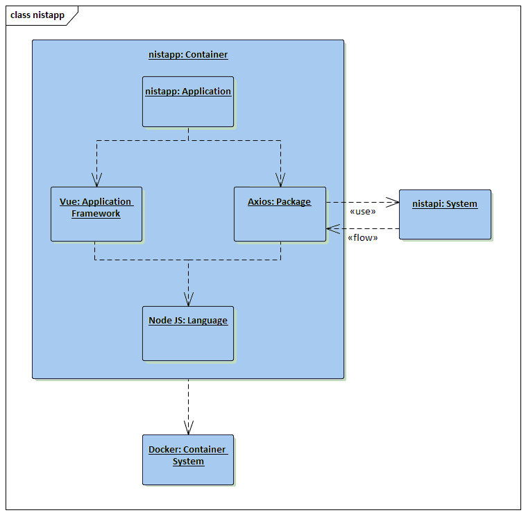

# NIST - Data over Documentation

NIST has a great set of documents that really does establish an incredible foundation
for Security and Privacy. The problem is consuming that documentation and making it
applicable to an enterprise level is a herculean task.

To aid in that consumption, I've created an app <i>(that consumes an API)</i> to make the presentation
of what I consider to be the fundemental data within that documentation a little more
managable.

Current build only has FIPS 200. I will add more as I tackle them.

For more info on this effort check out my blog: <a href="http://jburer.wordpress.com" target="_blank">http://jburer.wordpress.com</a>

## Fundementals

This is a simple Vue app that points to an API that makes the data available.



It is designed to be run inside a Docker container, but can be run as a node app locally as well.

The corresponding API and data are here.

## Docker setup

Clone the repository and move to the nistapp directory.

```
docker build -t <whatever>/nistapp .
docker run -d -p 8080:80 --name nistapp <whatever>/nistapp
```

This will make the app available on

```
http://localhost:8080
```
